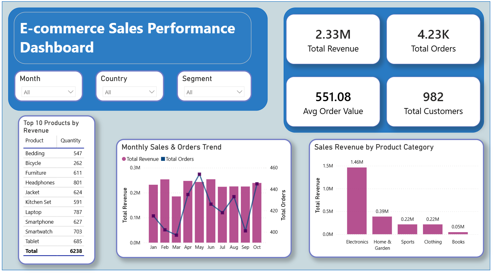

# 📊 End-to-End E-commerce Sales Analytics: Building a Single Source of Truth

 
 

## 📌 Project Overview
โปรเจกต์การวิเคราะห์ยอดขายครบวงจร (End-to-End E-commerce Sales Analytics) มีเป้าหมายหลักในการสร้าง **Single Source of Truth (SSOT)** หรือแหล่งข้อมูลหนึ่งเดียวที่เชื่อถือได้ โดยการเปลี่ยนข้อมูลดิบที่กระจัดกระจายให้เป็นข้อมูลคุณภาพสูงผ่านกระบวนการ **ETL บน SQL Server** และนำเสนอ Insight เชิงกลยุทธ์ผ่าน **Power BI Dashboard** เพื่อแก้ปัญหาความล่าช้าในการเข้าถึงข้อมูลและความไม่แม่นยำของตัวเลข KPI

---

## 🧭 Executive Summary
* **Single Source of Truth (SSOT):** สร้างแหล่งข้อมูลที่เชื่อถือได้ ลดความคลาดเคลื่อนของตัวเลข KPI และเพิ่มความเร็วในการตัดสินใจ
* **Data Quality Guaranteed:** ยืนยันคุณภาพข้อมูลหลังกระบวนการ ETL โดยเหลือข้อมูลที่ถูกต้อง **4,226 แถว** จากทั้งหมด 5,000 แถว
* **Strategic Action Plans:** วิเคราะห์ Insight ผ่าน **DAX Measures** เพื่อกำหนดแผนการตลาดเชิงรุกและกลยุทธ์การบริหารสต็อกสินค้า

---

## 🛑 โจทย์ทางธุรกิจ (Business Problems)
* **Fragmented Data Silos:** โครงสร้างข้อมูลกระจัดกระจายหลายเวอร์ชัน ทำให้การเข้าถึง Insight ล่าช้าและตัวเลขยอดขายไม่ตรงกันในแต่ละแผนก
* **Data Quality Issues:** ข้อมูลดิบปะปนด้วยรายการที่ไม่สมบูรณ์ (Cancelled, Returned, Error) ทำให้ KPI สูงเกินจริงและเสี่ยงต่อการตัดสินใจผิดพลาด
* **Lack of Segmentation:** ขาดข้อมูลพฤติกรรมลูกค้าเชิงลึก ทำให้การทำแคมเปญการตลาดเป็นแบบเหมาคลุม (Mass Marketing) และขาดประสิทธิภาพ

---

## 🏗️ Data Pipeline & Quality Results

1. **Ingest (Extract):** นำเข้าข้อมูลดิบ 5,000 รายการจาก CSV เข้าสู่ SQL Server ผ่าน SSMS พร้อมตรวจสอบจำนวนแถวและสถานะออเดอร์ที่ไม่ถูกต้องก่อนเริ่มขั้นตอนถัดไป (อ้างอิง: [sql_scripts/01_database_setup.sql](./sql_scripts/01_database_setup.sql))
2. **ETL (Transform):** ทำ Data Standardization และกรองข้อมูลขยะออก **774 รายการ (15.5%)** โดยคงเฉพาะออเดอร์ที่สถานะถูกต้อง เพื่อให้ได้ข้อมูลที่สะอาดพร้อมใช้งาน (อ้างอิง: [sql_scripts/02_data_cleaning.sql](./sql_scripts/02_data_cleaning.sql))
3. **Data Validation:** ตรวจสอบความถูกต้องจนมั่นใจว่ามียอด **Valid Rows 4,226 รายการ** ตามการคัดกรองใน SQL และค่า KPI ใน SQL Server ตรงกับ Power BI  (อ้างอิง: [sql_scripts/04_business_insights.sql](./sql_scripts/04_business_insights.sql))
4. **Modeling & Visualize:** ออกแบบข้อมูลแบบ **Star Schema** เพื่อความรวดเร็วในการ Query และสร้าง Interactive Dashboard (อ้างอิงโครงสร้าง: [Data Model_ecommerce-sales-ssot.PNG](./screenshots/Data%20Model_ecommerce-sales-ssot.PNG))

---

## 🎯 Key Business Insights & Action Plans

> ### 📈 Insight #1: Sales Performance (Peak Season)
> * **Finding:** ยอดขายในช่วง **เดือนมิถุนายน** มียอดขายพุ่งสูงกว่าค่าเฉลี่ยถึง **+30.9%** (อ้างอิง Measure `Peak vs Avg %` ใน [measures.dax.txt](./powerbi_dax/measures.dax.txt) ส่วนที่ 3)
> * **Action Plan:** เริ่มกระบวนการจัดซื้อตั้งแต่เดือนเมษายน (ล่วงหน้า 2 เดือน) เพื่อป้องกันสินค้าขาดสต็อก และเพิ่ม **Safety Stock 15%** สำหรับสินค้ากลุ่มศักยภาพ

> ### ⚖️ Insight #2: Category Optimization
> * **Finding:** รายได้ 88.75% กระจุกตัวอยู่ใน 3 หมวดหลัก ซึ่งมีความเสี่ยงหากตลาดผันผวน (อ้างอิง Measure `Top 3 Categories %` ใน [measures.dax.txt](./powerbi_dax/measures.dax.txt) ส่วนที่ 4)
> * **Action Plan:** ใช้กลยุทธ์ **Cross-Selling Bundles** เช่น "Laptop + Office Chair" เพื่อกระจายรายได้สู่หมวดอื่น และเร่งระบาย Dead Stock ในกลุ่มยอดขายต่ำ

> ### 👥 Insight #3: Customer Powerhouse
> * **Finding:** ลูกค้ากลุ่ม **"Regular"** และกลุ่มอายุ **55+** คือฟันเฟืองหลัก (Revenue 1.55M / Share 66.76%) (อ้างอิง: [measures.dax.txt](./powerbi_dax/measures.dax.txt) ในส่วน Customer Segment Analysis)
> * **Action Plan:** เน้นกลยุทธ์ **Retention** เพื่อรักษาฐานลูกค้าเดิม และปรับปรุง **UI/UX** (ขยายตัวหนังสือ/ลดขั้นตอนชำระเงิน) เพื่อรองรับกลุ่มผู้สูงอายุ

---

## 📈 Business Impact (Before vs. After)

| Metric | Before (CSV Manual) | After (SQL + Power BI) |
| :--- | :--- | :--- |
| **Data Source** | หลายไฟล์ หลายเวอร์ชัน (Data Silos) | **Single Source of Truth** |
| **Data Quality** | ปะปนด้วยข้อมูลขยะ (Invalid Orders) | **สะอาด 100% ผ่าน ETL Validation** |
| **Reporting** | ใช้เวลานาน เสี่ยง Human Error | **Automated Dashboard แบบ Real-time** |
| **Strategy** | ตัดสินใจจากความรู้สึก (Gut Feeling) | **Data-Driven ตัดสินใจแม่นยำจากข้อมูล** |

---

## 🖼️ Dashboard Preview

| **1. Sales Overview** | **2. Category Insights** |
| :---: | :---: |
|  |  |
| **3. Customer Insights** | **4. Key Business Insights** |
|  |  |

### 🔗 Explore the Data
> **ดูรายละเอียดเพิ่มเติมในรูปแบบ Interactive ได้ที่นี่:**
> 

---

## 📁 Repository Structure

| Folder / File | Description |
| :--- | :--- |
| 📂 [sql_scripts/](./sql_scripts) | SQL สำหรับทำ ETL Pipeline Cleaning และการวิเคราะห์ Business Insights |
| 📂 [powerbi_dax/](./powerbi_dax) | รวบรวมชุดคำสั่ง DAX Measures สำหรับการวิเคราะห์ Insight เชิงกลยุทธ์ |
| 📂 [dashboards/](./dashboards) | รูป Screenshot แสดงผลลัพธ์การวิเคราะห์ Business Insights ทั้งหมด | 
| 📂 [screenshots/](./screenshots) | หลักฐานผลลัพธ์การรัน SQL และโครงสร้าง Data Model|

---

## ✨ Key Takeaways
* **Data Quality First:** การ Validate ข้อมูลให้เชื่อถือได้คือพื้นฐานสำคัญที่สุดก่อนการวิเคราะห์
* **Performance Matters:** การออกแบบ Star Schema ที่ดีช่วยให้ Dashboard ประมวลผลได้รวดเร็ว
* **Data-Driven Strategy:** ข้อมูลจริงช่วยลบการคาดเดาและนำไปสู่การวางกลยุทธ์ที่แม่นยำ

---
